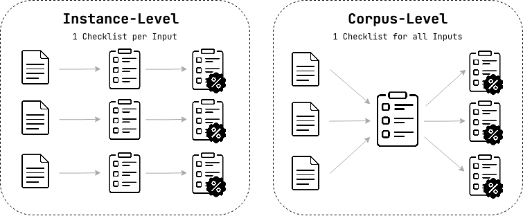

# AutoChecklist

[](https://github.com/ChicagoHAI/AutoChecklist)
[](https://www.python.org/downloads/)
[](LICENSE)

`AutoChecklist` is an open-source library that unifies LLM-based checklist evaluation into composable pipelines, in a `pip`-installable Python package (`autochecklist`) with CLI and UI features.

### Features
-  **Five checklist generator abstractions** that organize methods from research by their reasoning strategies for deriving evaluation criteria
-  **Composable pipelines** eight built-in configurations implementing published methods, compatible with a unified scorer that consolidates three scoring strategies from literature
-  **CLI** for off-the-shelf evaluation with pre-defined pipelines
-  **Multi-provider LLM backend** with support for OpenAI, OpenRouter, and vLLM

## Concepts

!!! tip "Terminology"
    - **`input`**: The instruction, query, or task given to the LLM being evaluated (e.g., "Write a haiku about autumn").
    - **`target`**: The output being evaluated against the checklist (e.g., the haiku the LLM produced).
    - **`reference`**: An optional gold-standard response used by some methods to improve checklist generation.


### Checklist Generator Abstractions



The core of the library is 5 generator classes, each implementing a distinct approach to producing checklists:

| Level | Generator | Approach | Analogy |
|-------|-----------|----------|---------|
| Instance | **`DirectGenerator`** | Prompt → checklist | Direct inference |
| Instance | **`ContrastiveGenerator`** | Candidates → checklist | Counterfactual reasoning |
| Corpus | **`InductiveGenerator`** | Observations → criteria | Inductive reasoning (bottom-up) |
| Corpus | **`DeductiveGenerator`** | Dimensions → criteria | Deductive reasoning (top-down) |
| Corpus | **`InteractiveGenerator`** | Eval sessions → criteria | Protocol analysis |

**Instance-level** generators produce one checklist per input — criteria are tailored to each specific task. **Corpus-level** generators produce one checklist for an entire dataset — criteria capture general quality patterns derived from higher-level signals.


Each generator is customizable via prompt templates (`.md` files with `{input}`, `{target}` placeholders). You can use the built-in paper implementations, write your own prompts, or chain generators with different refiners and scorers to build custom evaluation pipelines.

### Built-in Pipelines

The library includes built-in pipelines implementing methods from research papers ([TICK](https://arxiv.org/abs/2410.03608), [RocketEval](https://arxiv.org/abs/2503.05142), [RLCF](https://arxiv.org/abs/2507.18624), [CheckEval](https://arxiv.org/abs/2403.18771), [InteractEval](https://arxiv.org/abs/2409.07355), and more). See [Supported Pipelines](user-guide/supported-pipelines.md) for the full list and configuration details.

### Scoring

A single configurable `ChecklistScorer` class supports all scoring modes:

| Config | Description |
|--------|-------------|
| `mode="batch"` | All items in one LLM call (efficient) |
| `mode="batch", capture_reasoning=True` | Batch with per-item explanations |
| `mode="item"` | One item per call |
| `mode="item", capture_reasoning=True` | One item per call with reasoning |
| `mode="item", primary_metric="weighted"` | Item weights (0-100) for importance |
| `mode="item", use_logprobs=True` | Logprob confidence calibration |

### Refiners

Refiners are pipeline stages that clean up raw checklists before scoring. They're used by corpus-level generators internally, and can also be composed into custom pipelines:

- **Deduplicator** — merges semantically similar items via embeddings
- **Tagger** — filters by applicability and specificity
- **UnitTester** — validates that items are enforceable
- **Selector** — picks a diverse subset via beam search


## Installation

```bash
uv pip install autochecklist
```

For full setup options (source install, editable mode, vLLM extra, `.env` keys), see [Installation](getting-started/installation.md).

## Start Here

1. New users: [Quick Start](getting-started/quickstart.md)
2. Composing custom evaluation flows: [Pipeline Guide](user-guide/pipeline.md)
3. Running from terminal: [CLI Guide](user-guide/cli.md)
4. Picking a method from papers: [Supported Pipelines](user-guide/supported-pipelines.md)

## Minimal Example

```python
from autochecklist import pipeline

pipe = pipeline("tick", generator_model="openai/gpt-5-mini", scorer_model="openai/gpt-5-mini")
result = pipe(
    input="Write a haiku about autumn.",
    target="Leaves drift through cool dusk; amber fields breathe into night; geese stitch quiet skies.",
)
print(f"Pass rate: {result.pass_rate:.0%}")
```

## CLI Example

```bash
# Full evaluation (generate + score)
autochecklist run --pipeline tick --data eval_data.jsonl -o results.jsonl \
  --generator-model openai/gpt-4o-mini --scorer-model openai/gpt-4o-mini

# Generate checklists only
autochecklist generate --pipeline tick --data inputs.jsonl -o checklists.jsonl \
  --generator-model openai/gpt-4o-mini

# Score with existing checklist
autochecklist score --data eval_data.jsonl --checklist checklist.json \
  -o results.jsonl --scorer-model openai/gpt-4o-mini

# List available pipelines
autochecklist list
```

For all CLI flags and resumable runs, see [CLI Guide](user-guide/cli.md).

### Examples

Detailed examples with runnable code:

- **[custom_components_tutorial.ipynb](https://github.com/ChicagoHAI/AutoChecklist/blob/main/examples/custom_components_tutorial.ipynb)** - Create your own generators, scorers, and refiners
- **[pipeline_demo.ipynb](https://github.com/ChicagoHAI/AutoChecklist/blob/main/examples/pipeline_demo.ipynb)** - Pipeline API, registry, batch evaluation, export
- **[instance_level_demo.ipynb](https://github.com/ChicagoHAI/AutoChecklist/blob/main/examples/instance_level_demo.ipynb)** - DirectGenerator, ContrastiveGenerator (per-input checklists)
- **[corpus_level_demo.ipynb](https://github.com/ChicagoHAI/AutoChecklist/blob/main/examples/corpus_level_demo.ipynb)** - InductiveGenerator, DeductiveGenerator, InteractiveGenerator (per-dataset checklists)


## Citation

```
TBA
```

## License

Apache-2.0 (see `LICENSE`)
